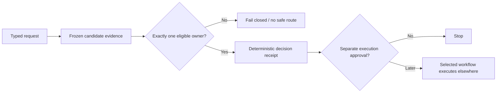

<p align="center">
  
</p>

# ChoiceGate

[](https://gitlab.com/krahul02004/ChoiceGate/-/commits/main)
[](https://pypi.org/project/choicegate/)
[](LICENSE)

ChoiceGate decides how an AI agent should get a task done. It weighs every candidate capability
(skills, local tools, MCP servers, integrations), and not just what is already installed: when
something materially better exists it surfaces that as an owner-approved install choice, and it
treats driving a browser or doing the work by hand as the explicit last resort. Every decision
returns a deterministic receipt recording what was chosen, why, and what it does not permit; on
malformed or ambiguous input it refuses with a named error, and it never installs, configures, or
runs what it selects.

## Getting started

**Prerequisites:** Python 3.11 or newer (standard library only, no third-party packages) to run the
command-line interface, and Claude Code to use ChoiceGate as a plugin.

**Install:** two labeled paths, pick the one you need.

- In Claude Code (one command): run `/plugin marketplace add https://gitlab.com/krahul02004/ChoiceGate`
  and then `/plugin install choicegate`. This is a self-hosted marketplace served from this
  repository (the root-level `.claude-plugin/marketplace.json`), and it is not published to any
  external or third-party plugin registry.
- Python CLI: `pip install choicegate`. This installs three console entry points
  (`choicegate-dispatch`, `choicegate-route`, and `choicegate-rank`) and needs nothing beyond the
  Python standard library.

**Check it works:** after the CLI install, run one command and confirm the usage line it prints.

```powershell
choicegate-dispatch --help
```

```text
usage: choicegate-dispatch [-h] request
```

## Why the gate exists

Capability selection is a policy decision, not a search-results list. An agent that grabs the first
plausible match will happily pick a tool that is not installed, not authorized, in conflict with
another owner, or described by stale information. ChoiceGate checks eligibility, authorization,
host compatibility, evidence freshness, and cost, breaks ties deterministically, and returns
exactly one path. When those checks cannot all be satisfied it fails closed: you get a
`no-safe-route` receipt naming the reason, never a best guess. A wrong refusal costs a retry; a
wrong selection runs the wrong thing.



## Beyond the installed stack

The candidate pool is not limited to what is already installed. Discovery walks a bounded tier
order (the current session's callable tools and skills, the client's plugin marketplace, the
official MCP registry, provider documentation, then narrow public-web corroboration; one focused
pass per tier), and every candidate carries one of five statuses that the ranker weighs directly:
`installed_usable` outranks `requires_auth_or_config`, which outranks `available_to_install`, while
`unverified_or_risky` and `browser_or_manual_fallback` contribute nothing to the score. A
not-yet-installed candidate must also clear a material-improvement gate before it can rank at all:
strong task fit, a credible advantage over doing the job by hand, and a weighted score of at least
65, or it is rejected with the reason recorded. Winners that still need installation or
configuration are never acted on; the router places them in a `setup-required` pool whose
disposition is `requires-owner-setup-approval`, and only an explicit owner-approved setup path can
move them further. Driving a browser or doing the work manually stays on the list as the explicit
last resort, offered only as an owner choice when no trustworthy integration is materially better.
And unknown is not neutral: a candidate whose security, privacy, or provenance cannot be verified
scores zero on those dimensions and is rejected, not guessed about.

## Try it

Thirty seconds, standard library only, from a bare checkout (Python 3.11+). The repository bundles
a sample request, `evals/choicegate/sample-family-request.json`:

```json
{
  "contract_version": "choicegate.family-request/v1",
  "request_id": "readme-try-it",
  "claims": [
    {"domain": "tools", "specificity": "explicit", "evidence_id": "owner-asked-for-a-local-cli"}
  ],
  "legacy_invocation": false
}
```

Feed it to the dispatcher (pass `-` to read stdin instead; after `pip install choicegate` the same
command is `choicegate-dispatch`):

```powershell
python -B scripts/select_family_leaf.py evals/choicegate/sample-family-request.json | python -m json.tool
```

Actual output (the `claims` echo is trimmed; everything else is verbatim):

```json
{
    "claims": [...],
    "decision": {
        "leaf_id": "choicegate-tools",
        "reason": "single-domain-claim",
        "route_type": "atomic-leaf"
    },
    "prohibited_actions": [
        "activate",
        "authorize",
        "configure",
        "enable",
        "execute-selected-capability",
        "expose",
        "install",
        "promote"
    ],
    "receipt_sha256": "e9c95a6a5f06248e59e8142ddcbc10e3531fb699580ca8bca3a5f3c8a98a3b7a",
    "receipt_version": "choicegate.family-dispatch-receipt/v1",
    "request_id": "readme-try-it",
    "request_sha256": "790416834f601a3c945bd058fbb3bbd76e9a333fde18ee92fdef77f74b89bdba"
}
```

One eligible owner, one receipt, request and receipt pinned by SHA-256, and an explicit list of
actions the selection does not authorize. Add a second `"explicit"` claim to the request and the
receipt becomes `no-safe-route` / `ambiguous-domain-claims`: the gate refuses rather than guessing
between two owners.

`choicegate-rank` needs no registry either: it scores caller-supplied candidates directly. A second
bundled request, `evals/choicegate/sample-rank-request.json`, describes one candidate. Two gotchas:
`candidates[].status` must be one of `installed_usable`, `requires_auth_or_config`,
`available_to_install`, `unverified_or_risky`, or `browser_or_manual_fallback`, and all twelve
`ratings` keys are required; a missing key is reported as "must be a number from 0 to 5".

```powershell
python -B scripts/rank_candidates.py evals/choicegate/sample-rank-request.json
```

Actual output, trimmed:

```json
{
  "duplicates": [],
  "fallback": null,
  "not_selected": [],
  "owner_choice_required": true,
  "ranked": [
    {
      "accepted": true,
      ...
      "score": 95.7,
      "source_url": "https://github.com/burntsushi/ripgrep",
      "status": "installed_usable"
    }
  ],
  ...
}
```

### Exercise the full router

The bundled `sample-route-request.json` embeds a 16-component synthetic registry profile and one
public-data candidate. It exercises the same inventory hashing, schema, lifecycle, exclusion,
ranking, and receipt path as an owner registry without publishing or pretending to reproduce the
owner's private snapshot:

```powershell
$choicegateCommit = git rev-parse HEAD
python -B scripts/route_capabilities.py evals/choicegate/sample-route-request.json `
  --choicegate-commit $choicegateCommit | python -m json.tool
```

The receipt selects `demo-local-formatter` as an executable atomic route, identifies
`registry_profile` as `public-demo-v1`, and records `accepted_registry_commit` as `null` because the
synthetic profile makes no Git provenance claim. Change any embedded component byte or use the demo
profile outside its fixed fixture scope and the router fails closed. Selection still does not run
the formatter or authorize any outward action.

## How it works

ChoiceGate is a family of seven small skills sharing one routing core. The first is a dispatcher
that routes a request to whichever of the other six owns it; each of those six does exactly one
job:

| Skill | Its one job |
|---|---|
| `choicegate` | Route a request to the one skill below that owns it, or return no safe route. |
| `choicegate-skills` | Pick one eligible skill, or one approved skill bundle. |
| `choicegate-tools` | Pick one local command-line tool or deterministic script. |
| `choicegate-integrations` | Pick one integration (API, plugin, MCP server, connector), or a receipt saying its setup needs owner approval. |
| `choicegate-generators` | Pick one model or media generation capability, without calling it. |
| `choicegate-context` | Pick one way to spend a stated context budget. |
| `choicegate-refresh` | Decide whether an earlier decision is still valid or must be redone. |

Two programs implement the family. `scripts/select_family_leaf.py` (`choicegate-dispatch`) is the
dispatcher you ran above; it needs nothing but the request. `scripts/route_capabilities.py`
(`choicegate-route`) is the full router: it takes frozen candidate evidence and judges it against a
capability registry (a separate, owner-maintained catalog of which capabilities exist and whether
they are installed, enabled, and authorized) that ChoiceGate pins by content hash so a decision
can never rest on a catalog that has silently changed. The owner snapshot itself is not in this
repository. The separately pinned synthetic profile above makes the complete router path publicly
reproducible without claiming owner authority. Strict JSON
(duplicate keys rejected), exact schemas, and canonical hashing apply to both programs, so every
receipt is reproducible byte for byte.


The demo uses the real local test result and contains no owner path, credential, remote claim, or
fabricated usage metric.

### Verify it yourself

The offline suite covers the dispatcher, all seven owners, trigger and near-miss fixtures, pairwise
domain collisions, strict JSON duplicate-key rejection, receipt hashing, adapter hash bindings,
packaging metadata, and deterministic package contents:

```powershell
python -B -m unittest discover -s tests -p "test_*.py"
python -B -m compileall -q scripts tools
```

A stronger maintainer suite additionally validates the router against the exact owner snapshot pinned in
`references/routing-contract.md`; see [docs/public/VALIDATION.md](docs/public/VALIDATION.md) and
[docs/public/ARCHITECTURE.md](docs/public/ARCHITECTURE.md).

## Install

```powershell
pip install choicegate
```

No runtime dependencies beyond the Python standard library. Three console entry points ship with
the package: `choicegate-dispatch` (family dispatch), `choicegate-route` (registry-bound
routing), and `choicegate-rank` (backward-compatible discovery ranking). Each reads strict JSON
from a file argument or `-` for stdin and writes one deterministic receipt. Builds are
deterministic and offline via the in-tree backend `tools/choicegate_backend.py`; see
[docs/public/VALIDATION.md](docs/public/VALIDATION.md) for the package and surface-package gates.

## Status

`0.1.0`, alpha, on PyPI. The portable 22-test suite and CI pass offline, including the synthetic
full-router profile; the owner-registry replay remains maintainer-only. Selection is never execution; the full list of actions this
project will never take is in [STATUS.md](STATUS.md).

## Governance

ChoiceGate is available under the [MIT License](LICENSE). Contributions follow
[CONTRIBUTING.md](CONTRIBUTING.md), the [Code of Conduct](CODE_OF_CONDUCT.md), and
[private security reporting guidance](SECURITY.md). Planned work and public-launch gates are in
[ROADMAP.md](ROADMAP.md).

Built by Rahul Krishna.
