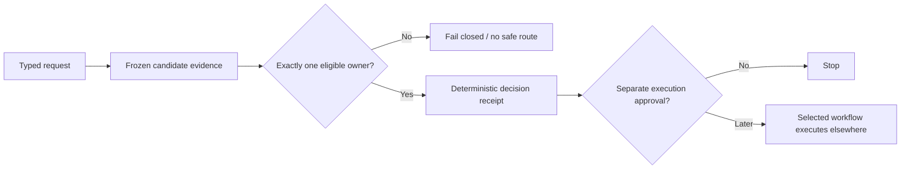
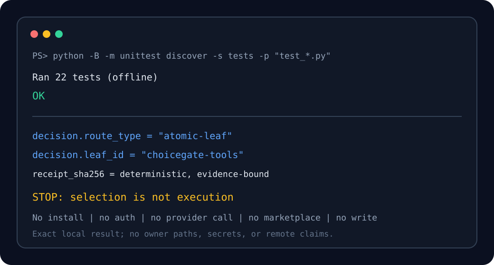

<p align="center">
  
</p>

<p align="center"></p>

# ChoiceGate

ChoiceGate is a seven-skill atomic family that selects one safe capability path from frozen,
evidence-bound candidates. It returns a deterministic receipt or fails closed; it does not execute,
install, authorize, authenticate, or configure the selected capability.

Lifecycle eligibility and routing priority remain owned by an external capability registry.
ChoiceGate binds to one owner-accepted registry snapshot by content hash and never mutates it. The
local `0.1.0` version is preparation metadata, not a marketplace entry, installation, or lifecycle
claim.

## Atomic family

| Canonical skill | One measurable outcome |
|---|---|
| `choicegate` | Select one domain leaf or return no safe route. |
| `choicegate-skills` | Select one eligible skill or approved skill bundle. |
| `choicegate-tools` | Select one eligible local executable or deterministic utility. |
| `choicegate-integrations` | Select one integration path or owner-gated setup receipt. |
| `choicegate-generators` | Select one generation capability without calling it. |
| `choicegate-context` | Select one measured context intervention within budget. |
| `choicegate-refresh` | Decide whether evidence remains fresh or rerouting is required. |

The historical `discover-better-tools` name is retained only as an explicit compatibility alias. It
does not own natural-language routing and cannot outrank a canonical ChoiceGate skill.

## Why the gate exists

Capability selection is a policy decision, not a search-results list. ChoiceGate applies lifecycle
eligibility, authorization, surface compatibility, evidence freshness, tool cost, and deterministic
tiebreaks before returning one path. Ambiguous ownership, stale evidence, malformed JSON, duplicate
keys, or an ineligible surface produces a typed failure or no-safe-route receipt.



## Local proof

The repository ships a standalone, offline test suite covering the family dispatcher, all seven
atomic owners, trigger and near-miss fixtures, pairwise domain collisions, strict JSON duplicate-key
rejection, receipt hashing, surface-adapter hash bindings, packaging metadata, and deterministic
package contents:

```powershell
python -B -m unittest discover -s tests -p "test_*.py"
python -B -m py_compile scripts/*.py tools/*.py
```

A stronger authority-bound suite validates the router against the exact owner-accepted
capability-registry snapshot pinned in `references/routing-contract.md`. That snapshot is not part
of this repository, so the authority-bound suite runs in the maintainer's environment; see
`docs/public/VALIDATION.md`.

## Demo



The demo uses the real local test result and contains no owner path, credential, remote claim, or
fabricated usage metric.

## Packaging

`pyproject.toml` packages the shared routing core as the `choicegate` Python distribution
(version `0.1.0`, MIT) using the deterministic, dependency-free in-tree backend in
`tools/choicegate_backend.py`:

```powershell
python -B -m build --no-isolation
python -B -m twine check dist/*
```

The repository also carries family-level `choicegate` manifests for Claude Code and Codex. Both
surface packages reuse the same neutral skills, scripts, schemas, and references, and are built
offline and deterministically:

```powershell
python -B tools/build_surface_packages.py --output dist
```

No marketplace entry is created; surface activation remains a separate registry lifecycle decision.

## Closed actions

This project does not create or change a remote, fetch, pull, push, query a marketplace or
registry, authenticate, call a provider, install or enable a plugin, activate or promote a skill,
or delete anything. Selection is never execution.

## Governance

ChoiceGate is available under the [MIT License](LICENSE). Contributions follow
[CONTRIBUTING.md](CONTRIBUTING.md), the [Code of Conduct](CODE_OF_CONDUCT.md), and
[private security reporting guidance](SECURITY.md). Planned work and public-launch gates are in
[ROADMAP.md](ROADMAP.md).

Built by Rahul Krishna.
