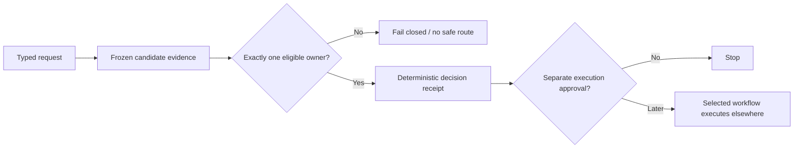

<p align="center">
  
</p>

# ChoiceGate

[](https://gitlab.com/krahul02004/ChoiceGate/-/commits/main)
[](https://pypi.org/project/choicegate/)
[](LICENSE)

ChoiceGate decides which one of an agent's available capabilities — a skill, a local tool, an
integration, a generator — should handle a task. It answers with a small JSON receipt that records
what was chosen, why, and what the decision does not permit, and the same request always produces
byte-identical output. When the input is malformed or two capabilities have an equal claim, it
refuses with a named error instead of guessing — and it never installs, runs, or configures what it
selects.

## Why the gate exists

Capability selection is a policy decision, not a search-results list. An agent that grabs the first
plausible match will happily pick a tool that is not installed, not authorized, in conflict with
another owner, or described by stale information. ChoiceGate checks eligibility, authorization,
host compatibility, evidence freshness, and cost, breaks ties deterministically, and returns
exactly one path. When those checks cannot all be satisfied it fails closed: you get a
`no-safe-route` receipt naming the reason, never a best guess. A wrong refusal costs a retry; a
wrong selection runs the wrong thing.



## Try it

Thirty seconds, standard library only, from a bare checkout (Python 3.11+). The repository bundles
a sample request, `evals/choicegate/sample-family-request.json`:

```json
{
  "contract_version": "choicegate.family-request/v1",
  "request_id": "readme-try-it",
  "claims": [
    {"domain": "tools", "specificity": "explicit", "evidence_id": "owner-asked-for-a-local-cli"}
  ],
  "legacy_invocation": false
}
```

Feed it to the dispatcher (pass `-` to read stdin instead; after `pip install choicegate` the same
command is `choicegate-dispatch`):

```powershell
python -B scripts/select_family_leaf.py evals/choicegate/sample-family-request.json | python -m json.tool
```

Actual output (the `claims` echo is trimmed; everything else is verbatim):

```json
{
    "claims": [...],
    "decision": {
        "leaf_id": "choicegate-tools",
        "reason": "single-domain-claim",
        "route_type": "atomic-leaf"
    },
    "prohibited_actions": [
        "activate",
        "authorize",
        "configure",
        "enable",
        "execute-selected-capability",
        "expose",
        "install",
        "promote"
    ],
    "receipt_sha256": "e9c95a6a5f06248e59e8142ddcbc10e3531fb699580ca8bca3a5f3c8a98a3b7a",
    "receipt_version": "choicegate.family-dispatch-receipt/v1",
    "request_id": "readme-try-it",
    "request_sha256": "790416834f601a3c945bd058fbb3bbd76e9a333fde18ee92fdef77f74b89bdba"
}
```

One eligible owner, one receipt, request and receipt pinned by SHA-256, and an explicit list of
actions the selection does not authorize. Add a second `"explicit"` claim to the request and the
receipt becomes `no-safe-route` / `ambiguous-domain-claims` — the gate refuses rather than guessing
between two owners.

## How it works

ChoiceGate is a family of seven small skills sharing one routing core. The first is a dispatcher
that routes a request to whichever of the other six owns it; each of those six does exactly one
job:

| Skill | Its one job |
|---|---|
| `choicegate` | Route a request to the one skill below that owns it, or return no safe route. |
| `choicegate-skills` | Pick one eligible skill, or one approved skill bundle. |
| `choicegate-tools` | Pick one local command-line tool or deterministic script. |
| `choicegate-integrations` | Pick one integration (API, plugin, MCP server, connector), or a receipt saying its setup needs owner approval. |
| `choicegate-generators` | Pick one model or media generation capability — without calling it. |
| `choicegate-context` | Pick one way to spend a stated context budget. |
| `choicegate-refresh` | Decide whether an earlier decision is still valid or must be redone. |

Two programs implement the family. `scripts/select_family_leaf.py` (`choicegate-dispatch`) is the
dispatcher you ran above; it needs nothing but the request. `scripts/route_capabilities.py`
(`choicegate-route`) is the full router: it takes frozen candidate evidence and judges it against a
capability registry — a separate, owner-maintained catalog of which capabilities exist and whether
they are installed, enabled, and authorized — that ChoiceGate pins by content hash so a decision
can never rest on a catalog that has silently changed; the registry snapshot itself is not in this
repository, and the bundled sample request above lets you try the gate without it. Strict JSON
(duplicate keys rejected), exact schemas, and canonical hashing apply to both programs, so every
receipt is reproducible byte for byte.


The demo uses the real local test result and contains no owner path, credential, remote claim, or
fabricated usage metric.

### Verify it yourself

The offline suite covers the dispatcher, all seven owners, trigger and near-miss fixtures, pairwise
domain collisions, strict JSON duplicate-key rejection, receipt hashing, adapter hash bindings,
packaging metadata, and deterministic package contents:

```powershell
python -B -m unittest discover -s tests -p "test_*.py"
python -B -m py_compile scripts/*.py tools/*.py
```

A stronger suite validates the router against the exact registry snapshot pinned in
`references/routing-contract.md`; see [docs/public/VALIDATION.md](docs/public/VALIDATION.md) and
[docs/public/ARCHITECTURE.md](docs/public/ARCHITECTURE.md).

## Install

```powershell
pip install choicegate
```

No runtime dependencies beyond the Python standard library. Three console entry points ship with
the package — `choicegate-dispatch` (family dispatch), `choicegate-route` (registry-bound
routing), and `choicegate-rank` (backward-compatible discovery ranking). Each reads strict JSON
from a file argument or `-` for stdin and writes one deterministic receipt. Builds are
deterministic and offline via the in-tree backend `tools/choicegate_backend.py`; see
[docs/public/VALIDATION.md](docs/public/VALIDATION.md) for the package and surface-package gates.

## Status

`0.1.0`, alpha, on PyPI. The portable 21-test suite and CI pass offline; the registry-bound suite
runs in the maintainer's environment. Selection is never execution — the full list of actions this
project will never take is in [STATUS.md](STATUS.md).

## Governance

ChoiceGate is available under the [MIT License](LICENSE). Contributions follow
[CONTRIBUTING.md](CONTRIBUTING.md), the [Code of Conduct](CODE_OF_CONDUCT.md), and
[private security reporting guidance](SECURITY.md). Planned work and public-launch gates are in
[ROADMAP.md](ROADMAP.md).

Built by Rahul Krishna.
